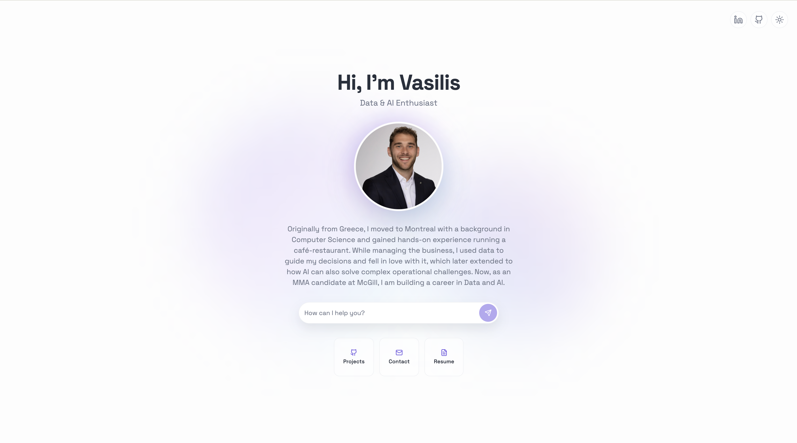
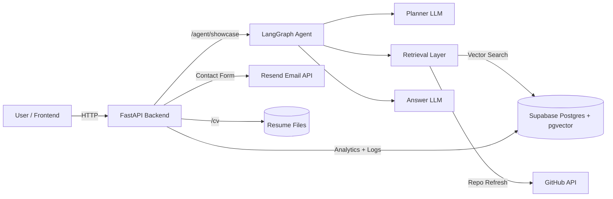
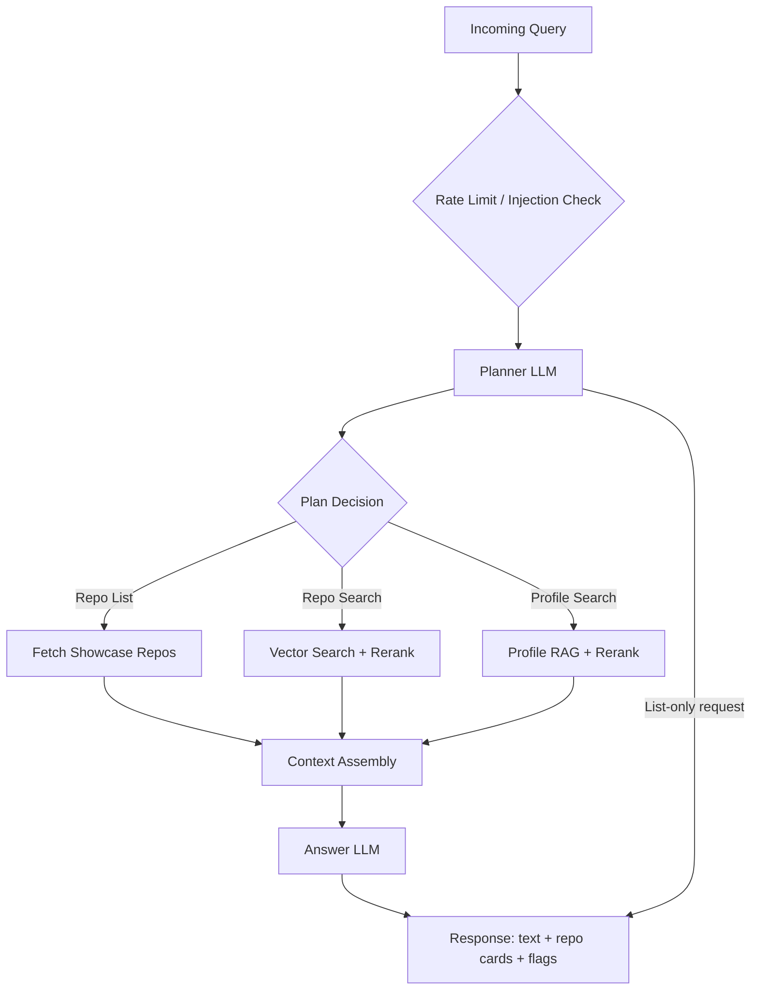

# 🚀 Portfolio Agent API

An AI-powered backend that turns a personal portfolio into a **recruiter-friendly Q&A experience**. It blends GitHub project data, a resume/CV knowledge base, and a planning agent to deliver concise, grounded answers with guardrails and performance optimizations.

Built to demonstrate **practical data/AI engineering skills**: RAG pipelines, vector search, LLM orchestration, caching strategies, and production-ready API design.

---

## Main Points
- **End-to-end agent system**: planning, retrieval, ranking, and response generation.
- **Data engineering choices**: chunking, hashing, caching, and data storing.
- **Observability & evals**: tracing and evaluation of agent behavior.
- **Production guardrails**: rate limiting, prompt-injection detection, and error handling.
- **Cost/performance awareness**: rerank skip rules, cost-optimized context engineering and cache refresh logic.

---

## Project Summary
This service exposes a FastAPI endpoint that answers questions about a portfolio/profile. The system:
1. **Plans** which sources to consult (repos, profile/CV, or both) and intent declaration to possibly skip calls (when not needed).
2. **Retrieves** relevant context with vector search + reranking.
3. **Responds** with a first-person portfolio answer, optionally returning repo cards for the UI.

---

## Example Flows (How Users Experience It)
**Example 1 — Recruiter asks about relevant projects**  
“Do you have any work related to LLM evaluation or agent systems?”  
✅ The planner triggers **repo + profile search**, retrieves top repo chunks and resume context, reranks for relevance, and replies with a concise summary for the most relevant projects.

**Example 2 — Hiring manager wants a CV**  
“Can I download your CV?”  
✅ The planner detects **CV intent**, skips retrieval/LLM calls, and returns a direct link to the latest resume file.

---

## High-Level Architecture

---

## Agent Flow (How It Works)

---

## Performance & Reliability Techniques
- **Supabase caching** of GitHub repos with TTL and content hashing.
- **Chunked embeddings** with overlap for robust semantic recall as well as context-providing headers.
- **Rerank skip thresholds** to avoid unnecessary LLM calls when vector scores are decisive.
- **Query rewriting** for broader profile questions to increase recall.
- **In-memory rate limiting** (IP/session) to protect endpoints.
- **Prompt injection detection** to block unsafe instructions.
- **Lazy client initialization** to reduce cold-start overhead.
- **Async analytics logging** to understand user behavior and what visitors are looking for without blocking API latency.

---

## Tech Stack
- **API**: FastAPI, Uvicorn
- **LLM Orchestration**: LangGraph, LangChain
- **Models**: OpenAI (chat + embeddings + optional rerank)
- **Tracing & Evaluation**: LangSmith
- **Vector Store**: Supabase Postgres + pgvector
- **External APIs**: GitHub API, Resend
- **Utilities**: httpx, pydantic, python-dotenv
- **UI**: Lovable

---

## Core Endpoints
- `GET /health` — health check
- `GET /cv` — download the latest CV
- `POST /agent/showcase` — agent Q&A + repo cards
- `POST /contact` — contact form submission
- `POST /event` — analytics event logging

---

## Next Steps
- Insight dashboard with main insights, such as most frequent questions, most popular repo, etc. using text analytics and data analysis.
- Admin dashboard for implementing changes without adjusting the codebase.
- Implementation of AGENTS.md and SKILLS for more robust agent architecture as well as evaluation.

## Notes
- Supabase schema is defined in `supabase_schema.sql`.
- Resume documents live in `docs/resume/` (latest modified file is served).
- The UI and link to the API was done with Lovable
